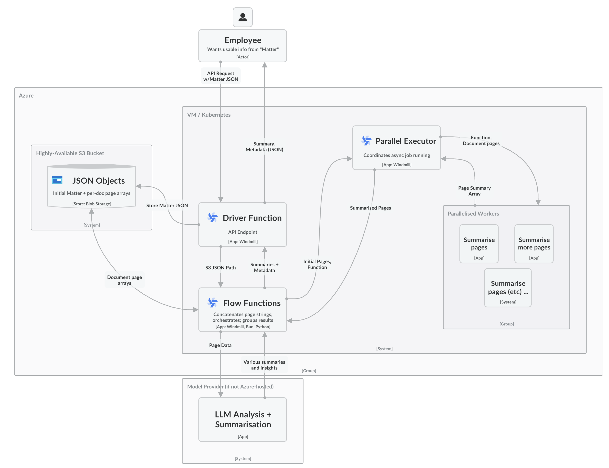

# Azure Infra Project
> A highly-available, parallelised system I built, architected, and hosted on Azure for an LLM automation startup!

## System Architecture Diagram

# Things I considered

## Key Design Choices
More faster, low-cost LLM calls than fewer costly, slow ones
> Rationale: way cheaper + faster; can self-host models
- (e.g, 3x Llama 3 70b instead of 1x Claude 3.5 Sonnet)

Decent time spent on system design / architecture planning
> Rationale: wanted to ensure HA + reliability in production
- (All non-dependent code/jobs execute asynchronously!)

Use of Windmill automation engine over a cloud function
> Rationale: Very flexible + robust abstractions generally
- (E.g, async job parallelisation, native S3 support, auth, etc)

## Scoping
### Scoped in: 
- Azure VM + Blob S3 configuration + deployment
	- Self-hosting of a locked-down Windmill instance
- Robust scripts to handle all aspects of Matter lifecycle
	- Including parallelisation of every potential blocker
- API endpoint deployment
	- Token/auth management

### Scoped-out (due to time/recovering from stitches)
* Features:
	* Calculate avg word confidence per-doc/page
	* Overlapping page contexts (did previously for a RAG)
* Reliability/Scaling
	* Kubernetes Cluster deployment
	* Highly Available Failovers (did previously for homelab)

## Pros/Cons
**Pros**
- Scalability (replicas, Kube Helm Chart)
- Security (handles team IAM/scoped token auths etc)
- Flexibility (any langs; Py/TS/JS/Bash/Go etc etc etc)
- Pog state management (async; share across scripts)
- Interoperability (Easy to chain scripts as workflow)
- Extensibility (simple to integrate external API's etc)

**Cons**
- Single point of failure (one partially-scaled Azure VM)
	- But: in prod, would use their Kube Helm Chart
- Slight reliance on 3rd party platform (Windmill)
	- But: open source; and can move scripts anytime

## Thought Process
_Choice: Python+TypeScript on Windmill thru Azure VM_

- Tried Azure Durable Functions first (painful)
	- Heard from (someone) it was mid && slow long-term
- Knew that either way, I'd be writing code (Py/JS/TS) to parse the JSON data
	- Spun up VM on Azure to allow rapid prototyping
- Went w/Windmill for 2 main reasons
	- Good async/replica support (+, Kube Helm Chart)
	_In prod, allows efficient scalability variable workloads_
	- Flexible language support + state management
	_Easy to maintain workflows + team collaboration etc_

